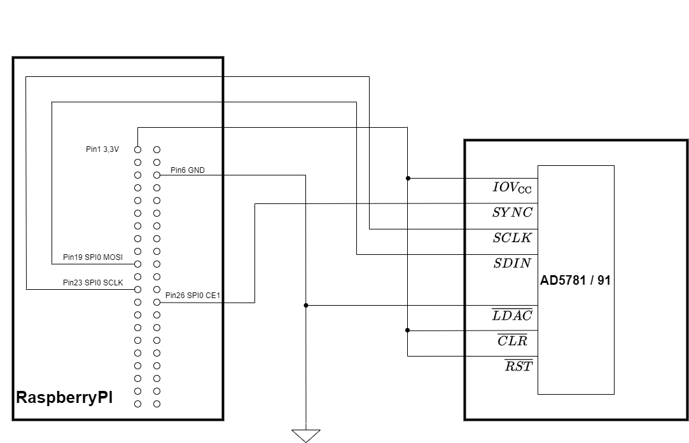

# AD5781 / AD5791

Ansteuerung des AD5781 [^1] bzw. AD5791 [^2] DA-Wandlers


## Ansteuerung via RaspberryPi mit dem Linux Industrial I/O Subsystem (IIO)

Kupier Linux [^3] von Analog Device, stellt die Linux Device Treiber für die Produkte von Analog Devices zur Verfügung. Allerdings unterstützt die Version 2023_r2 Patch1 noch keinen RaspberryPI 5 [^4]. Hier muss der Kernel mit den Treibern selber erstellt werden.  [RaspberryPI 5](#raspberrypi-5)

### Verbindung AD5781 / 91 mit dem RaspberryPI

<p align="center">

</p>


Wenn der DA-Wandler AD5791 angesteuert werden soll, kann das mitgelieferte DTBO File (rpi-ad5791.dtbo) verwendet werden. Hierzu muss der Treiber nur in der config.txt aktiviert werden:

```console
pi@raspberryPi5:~ $ sudo nano /boot/firmware/config.txt

# Uncomment some or all of these to enable the optional hardware interfaces 
#dtparam=i2c_arm=on 
#dtparam=i2s=on 
#dtparam=spi=on 
dtoverlay=rpi-ad5791 

pi@raspberryPi5:~ $ reboot
````

### Testen

 Um zu sehen, ob der Treiber erfolgreich aktiviert wurde:

```bash

root@raspberryPi5:~ # cd /sys/bus/iio/devices/iio\:device0 
root@raspberryPi5:/sys/bus/iio/devices/iio:device0# ls -la 
total 0 
drwxr-xr-x 3 root root     0 Jan 10 18:05 . 
drwxr-xr-x 5 root root     0 Jan 10 18:05 .. 
-r--r--r-- 1 root root 16384 Jan 10 18:05 name 
lrwxrwxrwx 1 root root     0 Jan 13 19:48 of_node -> ../../../../../../../../../firmware/devicetree/base/axi/pcie@120000/rp1/spi@50000/ad5781@1 
-rw-r--r-- 1 root root 16384 Jan 13 19:48 out_voltage0_raw 
-rw-r--r-- 1 root root 16384 Jan 13 19:48 out_voltage_offset 
-rw-r--r-- 1 root root 16384 Jan 13 19:48 out_voltage_powerdown 
-rw-r--r-- 1 root root 16384 Jan 13 19:48 out_voltage_powerdown_mode 
-r--r--r-- 1 root root 16384 Jan 13 19:48 out_voltage_powerdown_mode_available 
-rw-r--r-- 1 root root 16384 Jan 13 19:48 out_voltage_scale 
drwxr-xr-x 2 root root     0 Jan 13 19:48 power 
lrwxrwxrwx 1 root root     0 Jan 13 19:48 subsystem -> ../../../../../../../../../bus/iio 
-rw-r--r-- 1 root root 16384 Jan 13 19:48 uevent 
-r--r--r-- 1 root root 16384 Jan 13 19:48 waiting_for_supplier

````

### Anpassung AD5781

Wenn der DA-Wandler AD5781 angesteuert werden soll, dann muss das DTS-File angepasst werden. Hier finden Sie die entsprechenden Werte [^8].<br>
```console
compatible = "adi,ad5781";
````


Zusätzlich können noch weitere Parameter, wie z.B. die SPI Frequenz, angepasst werden

```console

		ad5781@1 {
				compatible = "adi,ad5781";
				reg = <1>;
				spi-max-frequency = <1000>;
				spi-cpha;
				vdd-supply = <&vdd>;
				vss-supply = <&vss>;
			};

````

jetzt muss das DTS-File noch in ein DTBO-File umgewandelt werden.

```console

dtc -I dts -O dtb -o rpi-AD5781.dtbo rpi-AD5781-overlay.dts

````
Dieses DTBO-File nach /boot/firmware/overlays/ kopieren und in der config.txt aktivieren.

```console
pi@raspberryPi5:~ $ sudo nano /boot/config.txt

# Uncomment some or all of these to enable the optional hardware interfaces 
#dtparam=i2c_arm=on 
#dtparam=i2s=on 
#dtparam=spi=on 
dtoverlay=rpi-ad5781 

pi@raspberryPi5:~ $ reboot
````


Nach der Anpassung auf den AD5781 werden auch die Wert für out_voltage_scale und out_voltage_offset automatisch angpasst

```bash

root@raspberryPi5:/sys/bus/iio/devices/iio:device0# cat out_voltage_scale  
0.019073559

root@raspberryPi5:/sys/bus/iio/devices/iio:device0# cat out_voltage_offset  
-131072

````

### Ansteuerung des DA-Wandlers

Mittels 

```bash
root@raspberryPi5: echo 0 > power_down_mode
````
wird der DA-Wandler in den "Normal Modus" geschaltet.

Dieser Befehl löscht das OPGNF und das DACTRI Flag und schaltet der DA-Wandler in den "Normal Modus"

Status Control Register nach "echo 0 > power_down_mode"

|  R/W <br> 23 |  Register address <br> 22,21,20 |Reserved<br>19 ,..., 10  |  LIN COMP<br> 6,7,8,9  | SDODIS<br> 5 | BIN / 2SC <br> 4   | DACTRI<br> 3   | OPGND <br>2| RBuf <br> 1| Reserved<br> 0|
|:---------:|:---------:|:---------:|:---------:|:-----------:|:----------:|:----------:|:------:|:----:|:--:|
|  0   |    0 1 0        |   0       |   0         |  0         | 1         | 0           | 0      | 1   | 0 |


Jetzt kann z.B. mittels

```bash
root@raspberryPi5: echo 262143 > out_voltage0_raw
````
der Ausgang des AD5781 auf $V_{RefP}$  gesetzt werden.

Diese Werte werden mittels "offset binary coding" codiert.

Beispiel AD5781:<br>

$V_{RefN} = -5V$ und $V_{RefP} = 5V$<br>
```console
-5V:  echo 0 > out_voltage0_raw
 0V:  echo 131072 > out_voltage0_raw
 5V:  echo 262143 > out_voltage0_raw 
````
<br>

$V_{RefN} = 0V$ und $V_{RefP} = 5V$<br>

```console
0V:  echo 0 > out_voltage0_raw
5V:  echo 262143 > out_voltage0_raw
````

#### PowerDownMode

Der Ausgang vom DA-Wandler kann in den Tristate Modus geschaltet werden bzw. es kann am Ausgang
ein 6Kohm Widerstand gegen Masse geschaltet werden.

Hier zu kann mittels:
```console
echo 6kohm_to_gnd  > out_voltage_powerdown_mode
bzw.
echo three_state  > out_voltage_powerdown_mode
````

der ensprechende Wert gesetzt werden. Diese Einstellung wird dann mittels

```console
echo 1 > power_down_mode
```
aktiviert.

Auszug aus dem Control Register:

|    | SDODIS<br> 5 | BIN/2sC <br> 4   | DACTRI<br> 3   | OPGND <br>2| RBuf <br> 1| Reserved <br> 0|
|:---------:|:-----------:|:----------:|:----------:|:------:|:----:|:--:|
| three_state  |     0       | 1         | 1           | 0      | 1   | 0 |
| 6kohm_to_gnd     |      0      | 1         | 0           | 1      | 1   | 0 |
|           |             |           |             |        |     |   |


### RaspberryPI 5 

Folgende Schritte sind durchzuführen um den Kernel direkt auf dem RaspberryPI 5 zu erstellen [^5],[^6],[^7]:

1. Flashen der SD-Karte mit dem akutellen Raspberry Pi OS

2. Buildverzeichnis erstellen<br>
  mkdir ~/build && cd ~/build

3. Repo von AnalogDevices clonen<br>
   git clone --depth=1 https://github.com/analogdevicesinc/linux -b rpi-6.6.y <br>
   
   --depth=1 : clont nur den letzten Commit und nicht die komplette Historie

4. export ARCH=arm64

5. cd linux

6. make adi_bcm2712_defconfig

7. make -j$(nproc) Image modules dtbs 

8. Backup vom Kernel <br>
    boot/firmware $ sudo cp kernel_2712.img kernel_2712_ori.img


9. Den erstellen Kernel mit dem korrekten Namen copieren<br>
 ~/build/linux/ $ sudo cp Image arch/arm64/boot/firmware/kernel_2712.img

10. Kopieren der Device Tree Files<br>
    sudo cp arch/arm64/boot/dts/broadcom/*.dtb /boot/firmware/ <br>
    sudo cp arch/arm64/boot/dts/overlays/README /boot/firmware/overlays/ <br>
    sudo cp arch/arm64/boot/dts/overlays/*.dtb* /boot/firmware/overlays/ <br>

11. Installieren der Module <br>
     sudo make modules_install

12. reboot

13. Test der Installation


```bash
pi@raspberryPi5:~ $sudo -i

root@raspberryPi5:cd /sys/bus/iio/devices/iio\:device0 

root@raspberryPi5:/sys/bus/iio/devices/iio:device0# ll 
total 0 
drwxr-xr-x 3 root root     0 Jan 10 18:05 . 
drwxr-xr-x 5 root root     0 Jan 10 18:05 .. 
-r--r--r-- 1 root root 16384 Jan 10 18:05 name 
lrwxrwxrwx 1 root root     0 Jan 13 19:48 of_node -> ../../../../../../../../../firmware/devicetree/base/axi/pcie@120000/rp1/spi@50000/ad5781@1 
-rw-r--r-- 1 root root 16384 Jan 13 19:48 out_voltage0_raw 
-rw-r--r-- 1 root root 16384 Jan 13 19:48 out_voltage_offset 
-rw-r--r-- 1 root root 16384 Jan 13 19:48 out_voltage_powerdown 
-rw-r--r-- 1 root root 16384 Jan 13 19:48 out_voltage_powerdown_mode 
-r--r--r-- 1 root root 16384 Jan 13 19:48 out_voltage_powerdown_mode_available 
-rw-r--r-- 1 root root 16384 Jan 13 19:48 out_voltage_scale 
drwxr-xr-x 2 root root     0 Jan 13 19:48 power 
lrwxrwxrwx 1 root root     0 Jan 13 19:48 subsystem -> ../../../../../../../../../bus/iio 
-rw-r--r-- 1 root root 16384 Jan 13 19:48 uevent 
-r--r--r-- 1 root root 16384 Jan 13 19:48 waiting_for_supplier

````


Danach können die IIO-Tools installiert werden.

```bash
sudo apt-get install libiio-utils
````

```console
pi@raspberryPi5:~ $ iio_info  
iio_info version: 0.26 (git tag:v0.26) 
Libiio version: 0.26 (git tag: v0.26) backends: local xml ip usb serial 
IIO context created with local backend. 
Backend version: 0.26 (git tag: v0.26) 
Backend description string: Linux raspberryPi5 6.6.63-v8-16k+ #1 SMP PREEMPT Fri Dec 26 14:35:16 CET 2025 aarch64 
IIO context has 2 attributes: 
       local,kernel: 6.6.63-v8-16k+ 
       uri: local: 
IIO context has 4 devices: 
[....]
````


[^1]: https://www.analog.com/media/en/technical-documentation/data-sheets/ad5781.pdf

[^2]: https://www.analog.com/media/en/technical-documentation/data-sheets/ad5791.pdf

[^3]: https://wiki.analog.com/resources/tools-software/linux-software/kuiper-linux#sd_card_image_and_release_notes

[^4]: https://ez.analog.com/linux-software-drivers/f/q-a/584295/upgrading-cn0566-to-raspberry-pi-5

[^5]: https://wiki.analog.com/resources/tools-software/linux-build/generic/raspberrypi

[^6]: https://www.linkedin.com/pulse/raspberry-pi-5-kernel-build-guide-david-zhu-pkihc

[^7]: https://blog.berrybase.de/raspberry-pi-5-grafikkarte-linux-kernel-kompilieren

[^8]: https://github.com/analogdevicesinc/linux/blob/rpi-6.6.y/Documentation/devicetree/bindings/iio/dac/adi%2Cad5791.yaml
